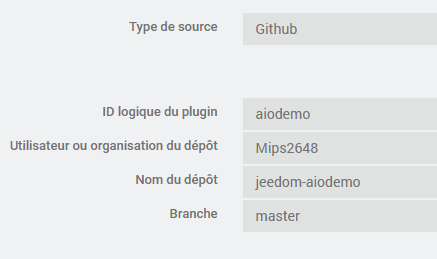

# aiodemo plugin pour Jeedom

This small plugin aims to demo the usage of a python daemon using asyncio.

## how to install

1. Add plugin from github source:

    - logical id: `aiodemo`
    - user: `Mips2648`
    - repo: `jeedom-aiodemo`
    - branch: `master`

    

2. Install dependencies
3. launch daemon

## how to test

As soon as daemon starts, a demo eqLogic should be created.
This eqLogic have some commands that will continuously change with info provided by the daemon.

There are also 2 extra actions commands to demo the fact that, thank to asyncio, the daemon can handle multiple tasks at the same time in parallel although everything is managed in the same threat.

- a *ping/pong* command will trigger 3 successive ping/pong messages by the daemon send in "immediate mode" but still asynchronously obviously
- a *think" command will trigger a random sleep and then the daemon will reply

All of them can be triggered several times without waiting the result of others occurrences.

## how is it working

I tried to comment as best as I can the example so I suggest you start by opening this file `resources\aiodemod\aiodemod.py` and read the comments.
I you ever wish to implement a asyncio daemon, you can use this example as base.

You will need 2 extra modules to be put in jeedom package (not yet present in #plugin-template):

- *aio_connector.py* module contains 2 classes:
  - `Listener` opens a tcp socket and will need a call a callback function once a message from Jeedom is received (replacing `jeedom_socket`)
  - `Publisher` takes care of sending data to Jeedom (replacing `jeedom_com`)
- *utils.py* module contains very similar method than `jeedom_utils` with only the relevant methods

And do not hesitate to reach out on [community]({{site.forum}}) if you have any question.
